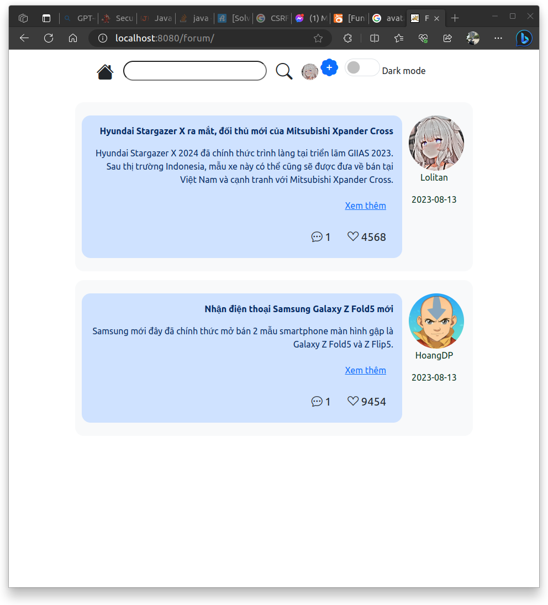
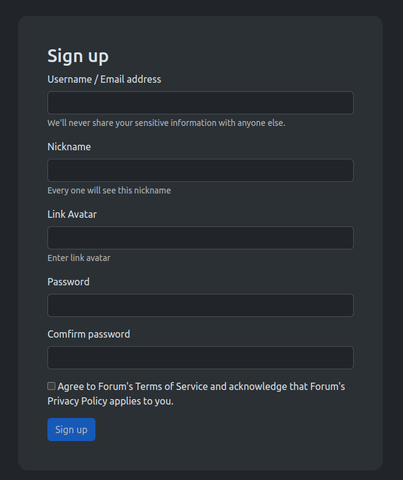
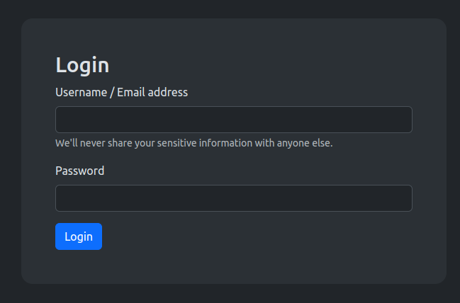

[![LinkedIn][linkedin-shield]][linkedin-url]

<!-- PROJECT LOGO -->
 

  

  <h3 align="center">Forum</h3>

  

    Developer by HoangDP
  

<!-- ABOUT THE PROJECT -->
## About The Project

A website forum is a place where people can interact with each other online, share their opinions, ask questions, and learn new things

(<a href="#readme-top">back to top</a>)

### Built With

* Java Servlet 6
* JSP
* JWT
* Hibernate 6
* Bootstrap 5.3
* PostgreSQL
* CSS
* HTML

(<a href="#readme-top">back to top</a>)

<!-- Screenshot -->
## Screenshot
</img>
</img>
</img>
</img>

<!-- LICENSE -->
## License

Distributed under the MIT License.

(<a href="#readme-top">back to top</a>)

<!-- CONTACT -->
## Contact

Phu Hoang - kunboy1608@gmail.com

Project Link: [https://github.com/kunboy1608/forum-serverlet](https://github.com/kunboy1608/forum-serverlet)

(<a href="#readme-top">back to top</a>)

<!-- MARKDOWN LINKS & IMAGES -->
<!-- https://www.markdownguide.org/basic-syntax/#reference-style-links -->
[linkedin-shield]: https://img.shields.io/badge/-LinkedIn-black.svg?style=for-the-badge&logo=linkedin&colorB=555
[linkedin-url]: https://www.linkedin.com/in/phu-hoang-046993236/
[product-screenshot]: images/open-api-3-user.png
